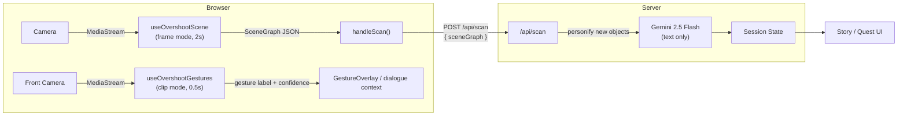
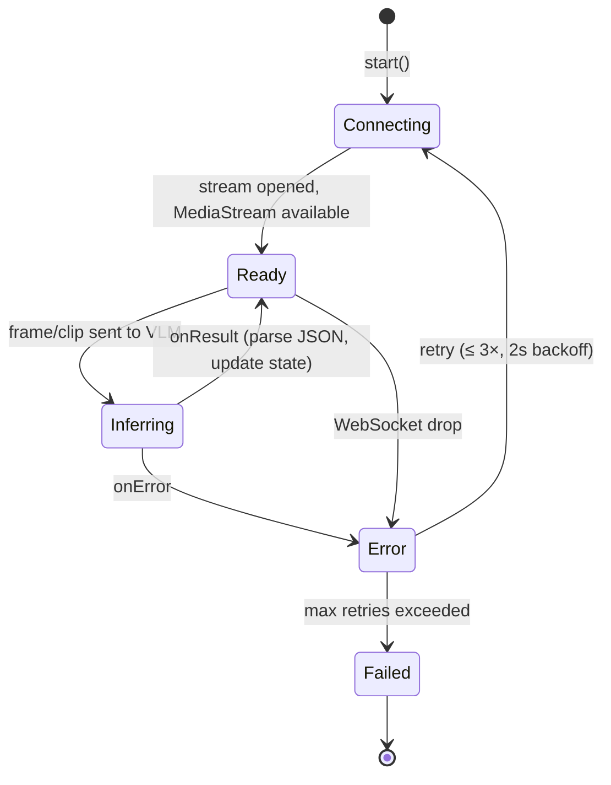
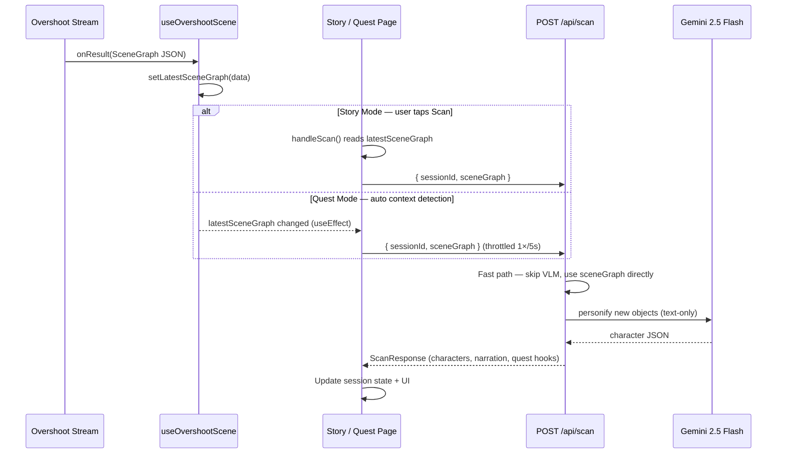
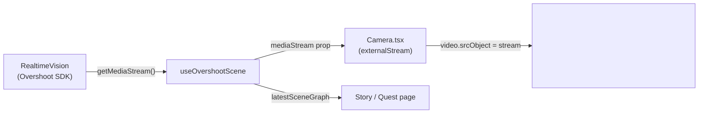
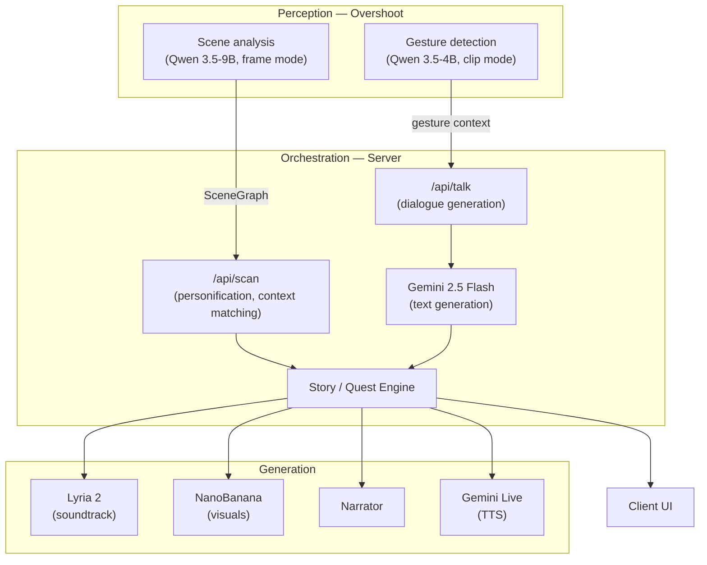

# Main Character Mode

Turn your world into a game. Point your camera at any object and watch everyday objects become characters with personalities, relationships, and quests — scored by adaptive music and wrapped in generated visuals.

Built for the YC x Google DeepMind Hackathon.

## Features

- **Real-time scene understanding** — Overshoot streams camera frames to a Qwen 3.5 vision model continuously, emitting a structured scene graph every ~2 seconds
- **Object personification** — detected objects become characters with names, personalities, emotional states, and relationship stances (lamp → jealous poet, chair → loyal bodyguard)
- **Gesture-aware interaction** — Overshoot clip-mode stream recognizes hand gestures (thumbs up, victory, open palm, etc.) and passes them as context to dialogue
- **Voice and text interaction** — tap any object-character to talk via modes like flirt, interrogate, recruit, roast, or apologize
- **Relationship and memory system** — characters remember conversations, form alliances and rivalries, and reference how you treated them
- **Quest generation** — characters issue contextual quests based on the environment and narrative state
- **Adaptive soundtrack** — Lyria 2 generates music that shifts with scene mood, narrative tension, and player actions
- **Visual synthesis** — NanoBanana generates character cards, expression variants, and session recap posters
- **Dynamic narration** — an AI narrator frames events in real time ("You turned away from the lamp. It took that personally.")
- **Two play modes** — Story Mode (object characters, dialogue, relationships) and Quest Mode (real tasks become cinematic missions with momentum and XP)
- **Auto context detection** — Quest Mode continuously matches the scene graph against active missions and activates them automatically
- **Session recap** — episode title, poster, relationship summaries, and dramatic highlights at end of session
- **Demo mode** — runs with hardcoded mock data, no API keys required

## Tech Stack

| Layer | Technology |
|-------|------------|
| Framework | Next.js 16 (App Router, Turbopack) |
| UI | React 18, Tailwind CSS 3, Framer Motion |
| AI — vision (live video) | Overshoot SDK (`overshoot`) — Qwen/Qwen3.5-9B (scene), Qwen/Qwen3.5-4B (gestures) |
| AI — dialogue & reasoning | Gemini 2.5 Flash (`@google/generative-ai`) |
| AI — voice (TTS) | Gemini Live API (`@google/genai`) |
| AI — music | Lyria 2 (Vertex AI) |
| AI — visuals | NanoBanana / Imagen 3 |
| Export | html-to-image, jsPDF, Jimp |
| Language | TypeScript 5 |

## Architecture

### Vision pipeline (Overshoot)

The app's real-time perception layer is powered by [Overshoot](https://platform.overshoot.ai), a WebSocket-based SDK that streams camera frames to hosted VLMs and returns structured JSON results directly to the browser. Scene understanding and gesture detection run **entirely client-side** as two persistent `RealtimeVision` streams, so the server never handles raw video and can skip the VLM call.

#### Two-stream overview



#### Stream 1 — Scene analysis (`useOvershootScene`)

| Property | Value |
|----------|-------|
| Hook | `src/hooks/useOvershootScene.ts` |
| Model | `Qwen/Qwen3.5-9B` |
| Mode | `frame` — sends a single still every interval |
| Interval | 2 seconds |
| Camera | Rear-facing (`cameraFacing: "user"`) |
| Output schema | `SceneGraph` — `{ sceneType, objects[], mood, spatialContext }` |
| Prompt | `sceneAnalysisPrompt(mode, genre)` from `src/lib/shared/prompts.ts` — genre-tinted object detection with salience ranking |

On each inference cycle the model receives one video frame and returns a `SceneGraph` JSON object listing up to 5 detected objects with salience scores, positional tags, and a mood reading. The prompt dynamically adapts to the active mode (story / quest) and the selected story genre (mystery, dating sim, fantasy, etc.), so the same room can produce different scene interpretations depending on narrative context.

The hook also exposes the underlying `MediaStream` so `Camera.tsx` can render the video feed directly — no second `getUserMedia` call is needed.

#### Stream 2 — Gesture detection (`useOvershootGestures`)

| Property | Value |
|----------|-------|
| Hook | `src/hooks/useOvershootGestures.ts` |
| Model | `Qwen/Qwen3.5-4B` |
| Mode | `clip` — sends short video clips for temporal reasoning |
| Clip length | 1 second at 6 fps |
| Delay between clips | 0.5 seconds |
| Camera | Front-facing (`cameraFacing: "user"`) |
| Output schema | `{ gesture: enum, confidence: number }` |
| Max output tokens | 30 (minimizes latency for a tiny JSON response) |

Recognized gestures: `thumbs_up`, `thumbs_down`, `victory`, `open_palm`, `closed_fist`, `pointing`, `i_love_you`, `none`.

The detected gesture feeds into two places: the `GestureOverlay` PiP panel (visual feedback) and the `/api/talk` dialogue endpoint (where gestures modulate the character's response and relationship delta).

**Trade-off vs MediaPipe:** Latency increases from ~100 ms (local MediaPipe) to ~500–1000 ms (network round-trip), but gesture labels are used as conversational context for dialogue — not as real-time input — so the slower cadence is acceptable and the VLM approach provides richer semantic understanding.

#### Stream lifecycle and resilience

Both hooks follow the same lifecycle with automatic retry on WebSocket failures:



Each hook creates a `RealtimeVision` instance on mount, retries up to 3 times on WebSocket errors (2-second backoff), and tears down cleanly on unmount. A shared module (`src/lib/shared/suppressOvershootErrors.ts`) patches `console.error` once in the browser to silence the SDK's internal WebSocket error logs, since the retry logic already handles them and the Next.js dev overlay would otherwise surface them as noise.

#### How scans flow through the system



#### Camera stream reuse

Overshoot opens its own `getUserMedia` handle internally. To avoid a second camera access, both `useOvershootScene` and `useOvershootGestures` expose a `mediaStream` property that `Camera.tsx` accepts via `externalStream`. When present, the `Camera` component skips its own `getUserMedia` call and renders the Overshoot-managed stream directly.



#### Mode-specific usage

| Capability | Story Mode | Quest Mode |
|-----------|-----------|-----------|
| Scene stream | `useOvershootScene("story", genre)` — genre tints the prompt | `useOvershootScene("quest")` — task/mission-oriented prompt |
| Gesture stream | `useOvershootGestures(true)` — feeds `GestureOverlay` + dialogue context | Not used |
| Scan trigger | Manual (player taps Scan button) | Automatic (every `latestSceneGraph` change, throttled 5s) |
| Server action | Personify new objects → create characters | Match scene context → activate missions |

### Full system



### How it works

1. `useOvershootScene` starts a persistent Overshoot frame-mode stream on page mount. Every ~2 seconds the Qwen 3.5-9B model returns a `SceneGraph` JSON object (objects, mood, spatial context) directly to the browser.
2. `useOvershootGestures` runs a parallel Overshoot clip-mode stream on the front camera. Qwen 3.5-4B classifies hand gestures every 0.5 seconds.
3. When the player taps **Scan**, `handleScan` sends the latest `sceneGraph` from Overshoot to `POST /api/scan`. The server skips any VLM call and goes straight to object personification (Gemini text) and context matching.
4. In **Quest Mode**, a `latestSceneGraph` change effect automatically calls `/api/scan` (throttled to 1× per 5 seconds) to check for mission activations.
5. Dialogue, narration, mission framing, and voice are handled server-side by **Gemini 2.5 Flash** — text-only, no camera frames involved.
6. Lyria 2, NanoBanana, and the narrator generate media conditioned on session state.

### Fallback behavior

If `NEXT_PUBLIC_OVERSHOOT_API_KEY` is not set, the Overshoot hooks log a warning and no stream is started. The app degrades gracefully:

- `Camera.tsx` falls back to its own `getUserMedia` call (no `externalStream` provided).
- The **Scan** button captures a raw JPEG frame via the `<canvas>` element and sends it as `{ frame }` to `POST /api/scan`.
- The server runs the same `sceneAnalysisPrompt` against Gemini's image analysis (server-side VLM call) instead of receiving a pre-analyzed `SceneGraph`.
- Gesture detection is unavailable — the `GestureOverlay` panel shows a "VISION ERR" state.

This means the full app works without Overshoot, but with higher latency (server round-trip for vision) and no gesture support.

## Project Structure

```
├── src/
│   ├── app/
│   │   ├── page.tsx             # Landing — mode selector, genre picker
│   │   ├── story/page.tsx       # Story Mode — Overshoot scene + gesture hooks, characters, quests
│   │   ├── quest/page.tsx       # Quest Mode — Overshoot scene hook, auto context detection
│   │   ├── recap/page.tsx       # Session recap poster
│   │   └── api/
│   │       ├── session/         # POST — create story or quest session
│   │       ├── scan/            # POST — sceneGraph (Overshoot) or frame (fallback) → personification
│   │       ├── talk/            # POST — dialogue with object-character
│   │       ├── action/          # POST — quest accept, choice, item use
│   │       ├── task/            # POST/GET — add task, list missions
│   │       ├── progress/        # POST — report quest progress
│   │       ├── music/           # GET — current Lyria track state
│   │       ├── poster/          # POST — generate recap poster
│   │       ├── expressions/     # POST — character expression variants
│   │       ├── recall/          # POST — dialogue with saved characters
│   │       └── suggest/         # POST — suggest player message
│   ├── components/
│   │   ├── shared/
│   │   │   ├── Camera.tsx       # Video display; accepts externalStream from Overshoot
│   │   │   ├── GestureOverlay.tsx  # PiP gesture panel; driven by Overshoot gesture stream
│   │   │   ├── NarrationBanner.tsx
│   │   │   ├── MusicIndicator.tsx
│   │   │   └── ...
│   │   ├── story/               # StoryHUD, InteractionModal, ObjectLabel, CharacterPortrait, etc.
│   │   ├── quest/               # QuestHUD, MissionBriefing, MomentumMeter, TaskInput, etc.
│   │   └── landing/             # TabBar, HowToPlay, CharacterCollection, PressStart, etc.
│   ├── hooks/
│   │   ├── useOvershootScene.ts    # Continuous scene analysis via Overshoot (frame mode)
│   │   ├── useOvershootGestures.ts # Gesture detection via Overshoot (clip mode)
│   │   └── useVoiceAgent.ts        # Voice interaction (STT + Gemini Live TTS)
│   ├── lib/
│   │   ├── shared/
│   │   │   ├── gemini.ts        # Gemini API wrapper (text + image fallback)
│   │   │   ├── lyria.ts         # Lyria API wrapper
│   │   │   ├── nanobanana.ts    # NanoBanana / Imagen 3 wrapper
│   │   │   ├── narrator.ts      # Dynamic narration generation
│   │   │   ├── sessions.ts      # In-memory session store
│   │   │   └── prompts.ts       # Central prompt templates (used by Overshoot and Gemini)
│   │   ├── story/
│   │   │   ├── personification.ts  # Object → character via Gemini
│   │   │   ├── relationships.ts    # Relationship graph and memory
│   │   │   ├── storyEngine.ts      # Story state machine, quest gen
│   │   │   └── escalation.ts       # Escalation triggers
│   │   └── quest/
│   │       ├── missionFramer.ts    # Task → cinematic mission
│   │       ├── contextDetector.ts  # SceneGraph → context tags
│   │       └── momentumTracker.ts  # Streaks, combos, momentum
│   └── types/
│       └── index.ts             # Shared TypeScript types
├── plans/
│   ├── DESCRIPTION.md
│   ├── PLAN.md
│   └── FEATURE_LIST.md
├── package.json
├── tsconfig.json
└── next.config.ts
```

## Quickstart

```bash
# Install dependencies
npm install

# Copy env template and fill in your keys (or leave demo mode on)
cp .env.local.example .env.local

# Start dev server
npm run dev
```

Open [http://localhost:3000](http://localhost:3000).

## Environment Variables

Copy `.env.local.example` to `.env.local`.

| Variable | Required | Description |
|----------|----------|-------------|
| `NEXT_PUBLIC_DEMO_MODE` | No | `true` (default) uses mock data, `false` makes live API calls |
| `NEXT_PUBLIC_OVERSHOOT_API_KEY` | For live mode | Overshoot API key — powers scene analysis and gesture detection. Get one at [platform.overshoot.ai/api-keys](https://platform.overshoot.ai/api-keys) |
| `GEMINI_API_KEY` | For live mode | Gemini 2.5 Flash key (server-side: dialogue, personification, narration, image fallback) |
| `NEXT_PUBLIC_GEMINI_API_KEY` | For live mode | Same key, exposed to browser for Gemini Live TTS |
| `LYRIA_PROJECT_ID` | For music | GCP project ID for Vertex AI |
| `LYRIA_LOCATION` | For music | Vertex AI region (default: `us-central1`) |
| `LYRIA_ACCESS_TOKEN` | For music | Short-lived Bearer token — refresh with `gcloud auth print-access-token` |
| `NANOBANANA_API_KEY` | For visuals | NanoBanana key (falls back to `GEMINI_API_KEY` for Imagen 3 access) |

## Scripts

```bash
npm run dev      # Start dev server (Turbopack)
npm run build    # Production build
npm run start    # Start production server
npm run lint     # Run ESLint
```

## Troubleshooting

**Camera not showing / stream stuck on "CONNECTING…"**
Overshoot opens its own `getUserMedia` stream. Make sure the browser has camera permission and that `NEXT_PUBLIC_OVERSHOOT_API_KEY` is set correctly in `.env.local`.

**Scan button does nothing**
In live mode, `handleScan` uses `useOvershootScene.latestSceneGraph`. If the Overshoot stream hasn't produced a result yet (first 2–3 seconds), the scan falls back to a captured frame and server-side Gemini analysis. Check the browser console for `[useOvershootScene]` errors.

**Gestures not detected**
The gesture stream uses `Qwen/Qwen3.5-4B` in clip mode. Ensure adequate lighting and hold the gesture for at least 1 second. The "GESTURE VISION" panel in Story Mode shows the stream status dot (green = ready, grey = connecting, red = error).

**`NEXT_PUBLIC_OVERSHOOT_API_KEY is not set` in console**
The hooks print this warning and no Overshoot stream is started. The app still works using the Gemini server-side fallback path in `/api/scan` — you'll just need to provide a `frame` (captured manually via the Scan button).

**Pre-existing TypeScript error in `extension/background.ts`**
The `extension/` folder contains a Chrome extension with a separate TypeScript config. The error (`Cannot find name 'chrome'`) is unrelated to the Next.js app and does not affect `npm run dev` or the live site.

## License

Hackathon project — not currently licensed for redistribution.
